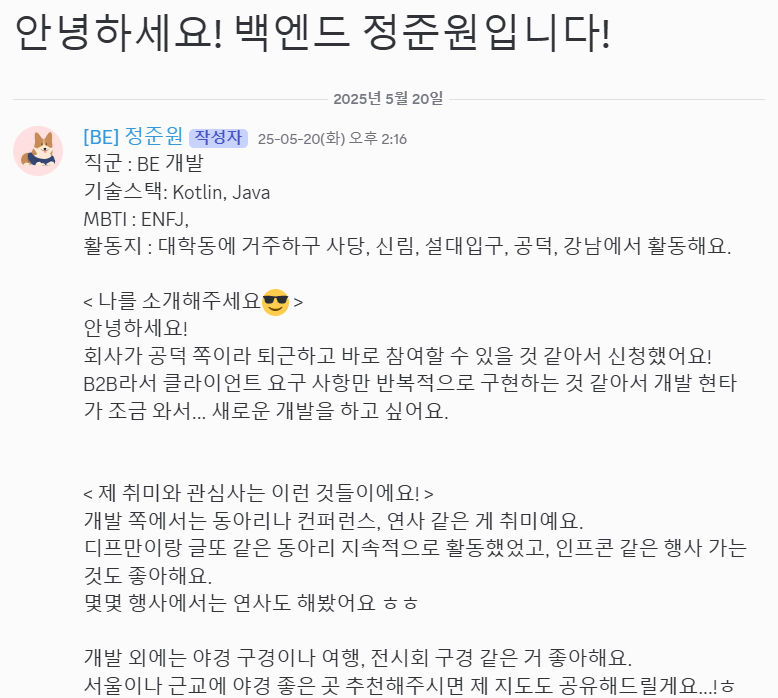
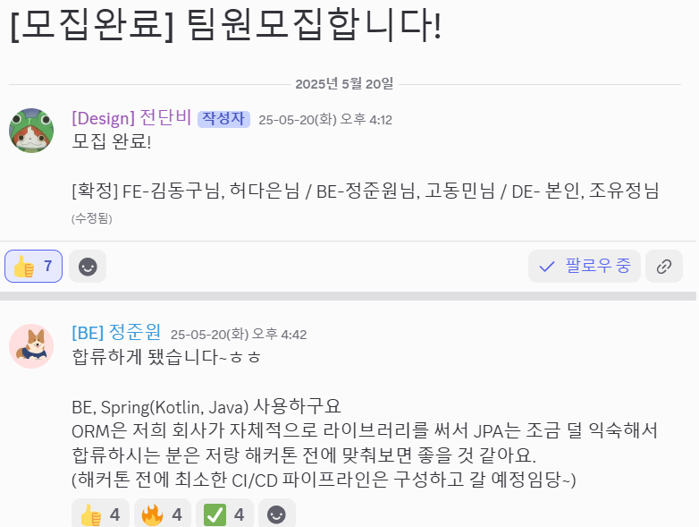

# TMI
올해 참여하면서 내가 작년에 남긴 후기 봤다는 분들이 많아서 뿌듯했다 ㅎㅎ
나는 누군지 모르는데 내 이름 보고 반가워 하시는 분이 있어서 조금 당황 ㅋㅋㅋ
그래도 내가 남긴 후기가 누군가에게 도움이 된다는 게 뿌듯했다.
그래서 이번 후기는 최대한 기억이 생생할 때 빠르게 남기려고 작성했다.


작년에는 부족함이 많았지만, 많이 성장해서 돌아온 해커톤에서는 대상을 받았다.
가볍게 DND 해커톤에 대해서 알고 싶은 분들은 제목 참고해서 취사선택하면 될 것 같다.

생생한 후기가 궁금한 분들은 TMI 느낌으로 작성된 글도 읽어보면 도움이 많이 될 것 같다.

# DND 해커톤??
```java
프로젝트에 즐거움을, 모두에게 기회를!
```


https://event-us.kr/dndacademy/event/101920

작년에 이어 두번째로 참여한 DND 해커톤.
작년 해커톤에서는 아쉬움이 많이 남았고 나의 부족함으로 팀원들에게 미안함이 많이 남았었다.

지금은 많이 성장했다고 생각해서 이번에는 성장한 모습을 느껴보고 싶었다.
경험이 있다는 점을 최대한 활용해서 효율적인 역할 배분과 개발을 하려고 노력했다.

## 모집 기간
- 2025년 04월 23일(수) 13시 ~ 05월 11일(일) 자정

모집 기간은 아주 널널하게 진행됐다.
마감이 일요일 자정이라서 마지막 날에 지원하는 사람이 많았을 것 같다.
나도 글 작성은 미리 해뒀는데, 마감 전 날에 한 번 더 점검하고 제출했었다.

## 해커톤 기간
- 2025년 05월 23일(금) 19시 ~ 05월 24일(토) 12시

아이스 브레이킹이랑 OT? 시간이 있어서 개발은 대략적으로 11시간 정도 주어졌다.

## 참가비
- 1인 2만원

작년에 18000원이었는데 물가 상승으로 인해 조금 오른 것 같다.
근데 사실 이런 거 하시는 분들은 참가비는 크게 신경 안 쓰는 것 같다.
5만원 이렇지만 않으면...?

## 참가 자격
- 나이
  - 만 19세 이상 성인만 가능**(미성년자 불가)**
- 경력
  - 대학생, 취준생, 6년 미만 현업자
- 프로젝트 경험
  - 1개 이상의 프로젝트 경험이 필수

작년과 가장 크게 달라진 점은 미성년자가 참가 불가능해졌다는 점인 것 같다.
기억에 남았던 고등학생 팀 같은 케이스를 못 보는 게 아쉬운 것 같다.
근데 밤을 새야해서 미성년자가 안되나...? 라는 생각이 들긴 한다.

## 해커톤 장소
- ICT COC (공덕 프론트원 6층)


IT 동아리 행사의 성지 프론트원에서 진행됐다.
ICT COC는 처음 가봤는데 좋으면서도 애매했다.
행사장 자체는 좋았는데, 책상이 대학교 강의실에 있는 바퀴 달린 작은 책상이었다.
계속 움직이고 책상이 흔들려서 불편했다.
심지어 작아서 서로 노트북 부딪히고 이런 게 좀 있어서 불편했다.
하지만, 서울 한복판에서 이런 넓은 장소를 대관해주시는 프론트원 최고...!
(~~책상은 그냥 작은 소소한 아쉬움 정도...ㅎㅎ~~)

## 참가 프로세스


기간만 다르지 작년이랑 거의 똑같은 프로세스였다.

## 시상


참가비는 2천원 올랐지만, 상금은 2등 기준으로 거의 2배 가까이 올랐다.
상을 받으면 더욱더 이득이라는 소리...?ㅋㅋ

이번에 특이하게도 경력자분들이 좀 많이 적고 대학생과 취준생이 많았다.
그래서 역시나 프리패스를 원하시는 분들이 좀 많았다.

작년에는 팀 단위로 줬던 것으로 기억했는데 혹시나 해서 확인해보니 작년에도 개인 2명에게 시상했다고 한다 ㅎㅎ
올해도 마찬가지로 개인 2명에게 프리패스 상을 시상했다.

우리 팀에서도 한 팀원이 프리패스를 엄청 원했는데, 해커톤이 진행되면 될수록 점점 혈색이 안 좋아지더니 프리패스 없어도 될 것 같다고 했던 기억이 난다 ㅋㅋ
사이드 프로젝트가 건강에는 안 좋을지도...?ㅋㅋㅋㅋ

# 신청
작년과 크게 다르지 않은 항목들이었던 것 같다.

## 서류 항목
### 자기 소개
- 지원 동기
- 개발 활동 중 모르는 문제 해결 경험

자기 소개라고 부를 수 있을 만한 항목은 위 두 가지였다.
지원 동기의 경우는 해커톤을 참여하는 이유와 기대하는 바를 작성했다.
지금 회사에서의 개발에서 흥미를 좀 잃었고 해커톤 같은 새로운 활동을 해보고 싶었다. 그리고 새로운 환경에서 직접 개발부터 배포까지 하는 게 재밌기 때문에 참여하고 싶었다.
거기에 DND는 꽤나 오랜 기수 운영된 동아리라서 일반적인 해커톤에 비하면 퀄리티가 높을 것이라는 기대가 있었다.

문제 해결 경험은 언제나 나오는 공식문서를 학습하는 게 좋다는 내용을 썼다 ㅋㅋ
거기에 최근에 블로그 글로 작성했었던 Redis Auto Configuration 문제 해결했던 경험을 작성했다.

사실 두 문항 모두 정석이라고 할 정도로 자소서에 많이 나오는 항목이라 크게 어렵진 않았다.
서류 작성하는 데 큰 시간이 걸리진 않았다.
다만 늘 그렇듯 미리 써두고 몇 번 첨삭을 거치긴 했다.

### 기타 항목
- 주력 기술 스택
- 프로젝트 가능한 서브 기술 스택
- 자신을 나타내는 자료 링크

아무래도 해커톤을 하려면 같은 파트끼리는 기술 스택이 맞아야 하는 게 있기 때문에 주력과 서브 기술 스택이라는 항목이 있지 않나 싶다.
주력은 당연히 Spring인데 언어에 대한 걱정이 조금 있었다.
요즘 코틀린을 주력으로 쓰는데 학생이나 취준생이랑 매칭되면 자바를 써야해서 조금 걱정이 있긴 했다.
그래서 경력인 분이랑 팀을 하고 싶긴 했다 ㅎㅎ

서브 스택은 DevOps랑 리액트(JS)를 작성했다.
개인 클라우드도 갖고 있고 3티어나 웬만한 규모의 배포는 할 수 있기 때문에 DevOps는 무리가 없었다.
리액트는 간단한 어드민 페이지 정도는 JS로 할 수 있어서 작성은 했는데 사실 크게 활용할 일이 없을 거라 생각했다.
해커톤에서 어드민 페이지를 만드는 경우도 거의 못 봤고, 프론트 분들은 대부분 TS기반이기 때문에 JS로는 크게 활용할 일이 없을 거라고 생각했다.

자료 링크는 뭐 늘 그렇듯 깃허브랑 블로그 링크를 달았다.

# 합격


이번엔 이벤트어스라서 주메일로 등록해놨고, 회사였지만 알림 울리자마자 확인했다 ㅎㅎ
무난하게 합격 한 것 같았고, 나중에 지인 통해서 듣기로는 점수 상으로 꽤나 높은 점수를 받았다고 한다.
열심히 글 쓰고 첨삭한 보람이 있었다 ㅎㅎ

작년과 마찬가지로 디스코드가 개설됐고, 초대 메일을 받았다.
디스코드에서 자기 소개를 올리고, 팀원 모집 글을 작성해서 팀을 빌딩하는 형태였다.

# 사전 작업
## 자기 소개

취미와 관심사 같은 것들을 작성하는 내용이 있었는데, 개발 관련 내용으로 작성했다.

해커톤에서 원하는 경험도 있었는데, CI/CD와 같은 것들을 미리 구성하면 좋겠다는 내용이랑 새로운 시도 같은 내용을 썼다.
네트워킹도 하고 싶었다.

## 팀 빌딩

개인 팀이 원래 그렇게 많지 않아서 가장 빠르게 모집 올리는 분이 열정적이지 않을까 싶어서
가장 먼저 올라온 팀원 모집 글에 신청을 넣었다.

단비님이 생각보다 많이 적극적이셔서 먼저 포트폴리오나 원하는 팀의 방향성 같은 것들을 공유해셨다.
내가 원하는 방향성이랑 팀 빌딩 방향성 같은 것들을 공유했다.
이후 팀에 합류하기로 해서 가장 먼저 합류하게 됐다.

아무래도 회사에서 JPA를 쓰지 않다 보니까 걱정이 조금 있긴 했었다.
대부분 JPA를 쓰실 테고 내가 익숙하지 않아서 걱정이 있었기 때문에 팀원 모집 글에 댓글로 남겨뒀었다.

이후 전체 팀원이 확정되고 나서는 파트 별 회의, 개발팀 회의, 팀 회의를 한 번씩 진행했다.

파트 회의에서는 코드 컨벤션이나 아래 작성될 서버 사전 준비 작업들에 대해서 의견을 나눴다.

### 개발팀 회의
개발팀 회의에서는 각자의 개발적인 목표를 공유했다.
이번 해커톤에서 얻고 싶은 점을 위주로 얘기했다.
- 요즘 개발 트렌드 파악
- 수상
- 새로운 기술적인 도전
정도가 나왔다.

우리가 개발할 수 있는 범위를 파악하기 위해서 각자 개발할 수 있는 기술 스택을 공유했다.
추가적으로 직장인인 사람들은 회사 도메인과 주력 기술도 공유했다.
역할분배할 때 참고하기 위해서였다.


기획에서 허용할 부분들에 대한 얘기도 나눴다.
아무래도 개발자들이 현실적으로 개발이 가능할 것 같은 범위를 알려줘야 효과적으로 기획을 할 수도 있고, 실제로 사용되지 않는 기능들은 필요없는 부분이 되기 때문이다.

지금 회고를 작성하다 봤는데, 개발 외에도 네트워킹에 대한 목표도 작성했었는데 시도 못해서 아쉽긴 하다.
새벽에 편의점에 갔다오기라던가 다른 팀의 개발자들과 소통해보기 같은 목표였는데 당일에 개발이 재밌어서 그거에 집중하느라 놓친 것 같다 ㅠㅠ

## 서버
### 서버 환경 세팅
- 오라클 클라우드 인스턴스
  - 우분투 20.04
  - Java 17
- MySQL
- Redis

오라클 클라우드를 원래 계속 사용하고 있어서 잠시 다른 포트 뚫어서 여기에 배포하는 형태로 생각했다.
RDB야 보통 쓰니까 MySQL을 설정하고, 팀원이 사용할 계정을 만들어서 권한을 부여햇다.

Redis는 혹시나 해서 설정해뒀다.
로컬 캐시를 써도 충분하지만, Redis를 주체적으로 제대로 사용해본 적이 없어서 이번에 캐시를 사용할 일이 생기면 Redis를 사용해보려고 했다.
사실 투 머치는 맞지만, 이전에 블로그 글을 쓴 것처럼 Redis에 대한 이해가 낮은 것 같아서 Redis를 한 번 a-z로 사용해보고 싶었다.


### Spring Boot 세팅
- Exception Handler
- Log Back
- MySQL 연동

기본적으로 기획에 상관없이 설정할 수 있는 부분들은 전부 세팅해뒀었다.
근데 한 가지 아쉬운 점은 다른 백엔드 분이 Custom Exception이 익숙하지 않은지 거의 사용을 안 하셔서 프론트 개발자분들도 참고하기 어려웠던 것 같다.
이런 것도 미리 맞춰두면 더 좋았을 것 같다.

근데, 확실히 Custom Exception은 필요했던 것 같은 게 에러 메시지만 보고도 프론트에서 조치를 할 수 있다는 점인 것 같다.
에러 메시지를 좀 자세히 분할해서 써두면 API 연동할 때 서버를 찾는 일이 크게 줄어들 수 있기 때문이다.


## DevOps
### CI/CD
이 부분은 내가 하진 않았고, 다른 팀원분이 설정해주셨다.
내가 작성했었던 CI/CD 설정 파일이랑 인스턴스 정보들을 공유해드리고 우리 세팅에 맞게 작성해달라고 요청했다.

설정이 처음에는 잘 됐는데, 환경 변수 쪽에서 꼬였는지 카카오 로그인 쪽에서 문제가 터지고, 직접 배포했을 땐 되는데 CI/CD로 배포됐을 때는 요상한 에러가 계속 터져서 포기했었다.
그래서 3-4시간 남았을 즈음부터는 직접 배포하는 것으로 바꿔서 진행했다.

local이랑 prod 환경이 분리되어 있어서 리다이렉션 url이 달라서 터지는 에러도 있었어서 그런 점도 준비가 미흡햇던 것 같다.

# 해커톤 진행


## 일정


킥오프 시간에는 간략한 설명과 DND에 대한 소개 등을 진행했는데, 30분까진 안 걸려서 아이스 브레이킹 시간을 더 가졌다.

아이스 브레이킹이 종료된 이후에는 주제를 공개하고 그 다음부터는 계속 팀 활동 시간이라서 팀 내에서 자유롭게 사용했다.
발표 장표는 다음날 9시까지 제출했던 것으로 기억하고, 이후 바로 발표를 시작했다.

발표하고나서 20-30분 정도 지난 후에 시상식?보다는 결과 발표가 이어졌다.
뭔가 시상식 같은 느낌은 아니었고, 그냥 결과 발표였다.

이후에 운영진분들께 들어보니 11시까지 대관이라 시간이 부족해서 소감 발표나 이런 것들을 하지 않고 바로 결과 발표하고 사진 찍고 끝냈다고 한다 ㅋㅋ

## 아이스 브레이킹

DND 관련 문제들과 개발/디자인 관련 문제들 나왔다.

DND 관련 문제들은 DND에 관심이 많으면 누구나 풀 수 있는 쉬운 문제들이었다.
개발/디자인 관련 문제들은 생각보다 쉽지 않았다.

평소에 대충 알고 있었던 내용이면 헷갈릴 수 있는 것들이었고, 실제로 확신을 갖고 푼 문제는 거의 없었다.
그래도 팀 내에 골고루 있어서 머리 맞대고 잘 풀면 됐다 ㅋㅋ

실제로 요것도 1등했다 ㅋㅋ


상품으로는 GS25 2만원권을 받았다

## 간식 시간!
간식은 요즘 해커톤이나 행사에 자주 등장하는 크라이 치즈버거였다.
대표님이 해커톤과 같은 걸 엄청 좋아하시는 것 같다.


해커톤을 해보셨다니...
나도 지금은 개발을 해도 결국 나중에는 요식업으로 가야하는 건가...ㅠㅠ

사실 미리 알았으면 저녁을 안 먹고 왔을 것 같기도 한데...
팀원들이랑 저녁 약속을 잡아서 근처 콩국수를 먹어서 배가 너무 불러서 받고 2-3시간 뒤에 먹었다.
콩국수도 진짜 양이 너무 많아서 남겼다...ㅎㅎ

## 주제


주제는 작년과도 비슷한 것 같다.
**지역 사회 문제를 해결할 수 있는 서비스**

뭔가 요즘 해커톤에서 자주 나오는 주제 같다.
엄청 넓기도 하면서 또 웬만한 것들은 다 이미 서비스가 나와있는 그런...?ㅋㅋㅋ
주제 선정에서 쉽지 않았다.

### 우리팀 아이데이션

저번 해커톤과 비슷하게 이번에도 피그잼을 사용해서 아이데이션을 했다.

각자 주제와 관련한 경험을 공유하고, 의견을 제출했다.

이후 각자 아이디어에 우선순위를 작성해서 직접 자기 아이디어를 선택해서 제출했다.
아이디어들에 대해서 팀원 전체가 투표를 진행했다.

2가지 아이디어가 경쟁했는데 거기서 '로컬 문화산책 오디오 가이드'가 선택됐다.
이후 컨셉은 동네의 장소들에 의미를 부여할 수 있게끔 지역 주민들이 직접 녹음하거나 추억 사진을 남기는 쪽으로 잡았다.


우리가 설정한 페르소나는 다음과 같았다.
이야기 하길 좋아하는 동네 주민, 고향에서 추억을 되새기고자 하는 사람, 외지 방문객 3가지였다.

내가 주장했던 건 처음부터 페르소나는 확실하게 정해서 해당 페르소나들이 필요로하는 기능만 개발하고 싶었다.
워크플로우도 거기에 맞게 설계하고 싶은 욕구가 있었다.

어차피 해커톤은 MVP만 개발하는 걸 목표로 하고 있고, 사용되지 않는 기능은 시간 낭비만 될 수 있기 때문이다.
사실 어떤 서비스를 만드려고 해도 비슷한 서비스가 이미 존재하는 경우가 많아서 우리 서비스만의 장점을 명확하게 만드려면 페르소나 설정이 꼭 필요하다고 새악ㄱ했다.


## 어려웠던 점
### 건물 단위의 위치 지정
대부분 X, Y 좌표로 지정하는 데, 우리는 건물 단위로 위치를 지정하고 싶었다.
하지만, 좌표가 아닌 주소를 사용할 경우에는 지도 서비스를 한 번 거쳐야 되기 때문에 볼륨이 너무 커진다고 판단했다.
그래서 pin 좌표를 지정하고 거기만 데이터가 저장되도록 했다.

그 문제점으로 우리가 직접 만든 pin에만 데이터를 넣을 수 있다는 문제가 있었다.
만약 고도화한다면 X, Y 좌표를 바탕으로 넣어도 주소로 변환해서 아무 장소에나 pin을 박을 수 있게 하거나 그 반대를 구현해볼 것 같다.

### Presigned URL
처음해보는 거라서 쉽지 않았다.
ACL 설정에서도 막혔었는데 아직 ACL과 퍼블릭 엑세스의 차이를 명확히 모르고 있다.
그 부분도 공부해볼 예정이다.

그리고 presigned URL을 사용해서 유저가 데이터 저장에 성공했는지 체크하는 게 없어서 메타 데이터가 낭비되는 지점이 있다.
그런 부분도 고쳐야할 부분인 것 같다.

### 깃 브렌치 이동 시 커밋 안하고 변경 사항 임시 저장
이거 아직도 모르고 있었던 거였는데 해커톤하면서 급하니까 알게 됐다ㅋㅋㅋ
매번 브렌치 이동할 때 .. 이런 메시지로 커밋 찍었다가 되돌리고 그랬는데 이제 해결 법을 알게 됐다.

- git stash push -u -m "임시 저장"
- 다른 브렌치 갔다 온 뒤
- git stash pop

이렇게 하니까 됐었다.

커밋을 사용했을 땐 회사에서 실수로 임시 저장 메시지 있는 상태로 커밋 올렸다가 혼났던? 적도 있어서 유용하게 사용할 것 같다 ㅎㅎ
이런 게 또 해커톤의 묘미아닌가 싶다.

### multipart
이건 어려웠던 건 아니고 알게된 부분인데, multipart를 사용해서 파일 업로드를 할 때는 파일을 WAS에 저장한다고 한다.
Spring에서 제공하는 기능이라 WAS에 저장했다가 요청 처리가 끝나면 삭제하는 형태로 동작한다고 한다.
그래서 동시 요청이 많으면 스레드가 빨리 소모되고 서버에 문제가 있을 수 있다고 한다.

Presigned URL 공부하다가 궁금해져서 비교했는데 multipart에 이런 문제가 있다는 것도 처음 알아서 재밌었다.

## 발표

발표는 5분 내외, QnA는 2분 정도? 했던 거 같다.
전체적인 발표는 아무래도 기획 관련 얘기가 많아서 단비님이 진행해주셨다.

문제 정의 -> 백그라운드 -> 필드 리서치 -> 페르소나 -> 솔루션 -> 시나리오 -> 시연
정도의 흐름으로 진행됐다.


발표에서는 기획적인 부분에 대해서 많이 얘기했다.
문제를 정의하고, 이 문제를 왜 문제라고 인식했는지부터 시작했다.
그리고 문제를 어떤 방식으로 해결하고자 했는지, 어떤 결과가 나왔는지를 중점적으로 다뤘다.

당연히 시나리오도 얘기했는데 우리가 지정한 페르소나들이 어떤 시나리오로 문제를 해결하는지에 대한 내용이었다.
시연에서는 그 시나리오에 따라 어떻게 결과물이 나왔는지 직접 보여주는 형태로 진행했다.

## 🥇결과 - 대상🥇


페르소나랑 시나리오 설정은 잘 했는데 프로덕트에서 아쉬운 점들이 있기도 했고 발표나 시연 시간이 짧아서 원하는 만큼 얘기를 다 못한 것들이 있어서 1등은 생각도 못했다.
2등은 받을 수 있지 않을까 생각했는데 대상을 수상했다.
기대도 못 했는데 대상까지 받아서 기분이 좋았다.

상금은 이후 뒷풀이에서 사용되지 않을까 싶다.
연차 쓰고 오신 분도 있고 그래서 1등이라도 해야 그나마 하루 일당 빠진다는 농담을 했었는데 1등해서 하루 일당을 어느정도는 챙긴건가...?ㅋㅋㅋ


아래에서는 수상을 하게 된 요인이 무엇일까 조금 생각해서 분석해본 내용이다.

## 수상 요인 분석
### 지정된 페르소나의 시나리오를 기반으로 필요한 것만 개발하기
이걸 가장 중요하게 생각했다.
위에서 말한 것처럼 MVP만 개발하면 되고, 사용되지 않는 기능은 시간 낭비라서 개발 시간이 짧은 해커톤에서는 필요 없는 부분이라 생각했기 때문이다.

### '수요'라는 무적의 창 만들기
이것도 계속 얘기한 것처럼 당근, 네이버, 카카오 등 거대한 게 많아서 대부분의 서비스는 존재하고 그걸 이기는 건 불가능하다.
QnA가 존재하면 항상 많이 나오는 공격적인 질문도 '~~에서 이미 하고 있는데, 왜 굳이 우리 서비스를 써야하나요?'이다.

그래서 필요한 게 '수요층'이라고 생각한다.
다른 서비스에서는 없는, '**우리만 가능한 무엇인가**'를 명확하게 만들어서 '특정 유저는 우리 서비스를 사용하게 될 것이다.'라는 시나리오가 필수라고 생각한다.

### 필드 리서치
우리는 빠르게 기획이 나왔기 때문에 설문조사를 바로 진행했다.
내가 짧게 남긴 '설문조사를 해서 기획의 정당성을 부여하자.' 라는 의견에 단비님이 엄청 적극적으로 동의하셨다.
설문조사도 엄청 빨리 준비해서 진행하고, 외부에 나가서 다양한 분들도 인터뷰해오실 정도로 열정적으로 하셨다.

아무래도 기획의 정당성을 부여하고 수요층이 있다는 증거가 있는 게 좋아서 설문조사를 실시했는데 효과가 좋았던 것 같다.

### AI 활용
우리가 기획했다고 해도 급하게 만들어진 기획이기 때문에 짜임새가 높지 않을 수 있고, 전문성이 부족하거나 획일화되지 않을 수 있다.
그리고 시간이 흐르면서 방향이 갑자기 이상하게 향하고 있을 수도 있다.

이를 방지하기 위해서 GPT에 프롬프트를 만들어서 기획자 역할을 하도록 만들었다.
가스라이팅 좀 시전해주고 GPT에게 기획 관련 질문을 하거나 페르소나를 명확하게 하는 데 도움을 받는 등 유용하게 사용했다.


# 회고
## 공개 회고


회고도 그렇고 블로그 글이나 후기도 그렇고 시간이 지날수록 기억이 희미해지기 때문에 빠르게 해놓고 싶었다.
어떤 점을 배웠는지, 아쉬웠던 건 뭐가 있었는지 최대한 기억이 생생할 때 정리하고 싶었다.

공개적으로 회고할 사람을 모았는데 신청자가 많이 없어서 시간이 조금 흐른 6월 1일에 사당에서 회고를 했다.

어쩌다 보니 운영진 한 분과 1대 1로 회고를 진행했다 ㅋㅋ
이번에는 저번과 다르게 학생분들이 많았는데 회고라는 것에 익숙하지 않은 분들도 많았고,
들어보니 축제 시즌이랑 기말 시즌 이런 거 때문에 그랬던 것 같다.

## 팀 내 회고
팀 내 회고는 원래 끝난 다음 날인 일요일에 진행하자고 했는데, 팀원들이 다들 피곤해서 약간 미뤘다.

디프만 15기 같은 기수에서 나왔던 [**Layer**](https://www.layerapp.io/) 를 사용해서 회고를 했다.

### 목표
평균 목표 달성률은 76% 였다.
각자의 목표는 수상, 단기간 밀도 높은 경험, 개발 완료 등이 있었다.

목표를 달성하게 한 원인으로는
- 활발한 의사소통
- 사전 목표 공유
- 명확한 목표 의식
- 일정한 시간 지정
  - 2시간에 한 번 회의를 했던 걸 말하시는 것 같다
- 명확한 역할 분담

정도가 나왔다.

### 성과
- 👑**1등**👑
- 재미
- 기술적 도전
  - presigned URL
presigned URL을 직접 구현해본 적이 없었는데 이번에 시도해봐서 재밌었다.

### 개인의 성장한 부분
- 소통의 중요성
- 오너십의 중요성
- 디테일의 중요성
- 현실적으로 가능한 범위를 설정하는 것

### 개선이 필요한 지점 & 시간이 낭비되었다고 생각되는 지점
- 다른 파트에 대한 이해도
  - 다른 파트와 협업을 위해서는 기초적인 지식을 더 공부하는 것이 좋을 것 같다.
- 덜어내기
  - 항상 느끼는 건데, 너무 많은 걸 하고 싶어하는 것도 문제다.
  - CI/CD랑 로그, 모니터링 시스템 등을 사전에 구축했는데 해커톤 정도의 볼륨에서는 없어도 크게 문제가 되진 않았던 것 같다.
  - CI/CD의 경우에는 설정을 잘 못해서 제대로 사용할 수 없어서 직접 배포 했기 때문에 그 점도 아쉬웠다.

### 팀 내 의사소통에서 중요하다고 느낀 점은?
- 회의 vs 개발
  - 회사에서는 사실 개발하는 시간보다 회의하는 시간이 더 많은 것 같다.
  - 그럴 때는 내가 개발자가 맞는지에 대한 고민이 생긴다.
  - 근데 또 다 같이 같은 상을 그리기 위해서는 회의가 많이 필요한 것은 맞다.
  - 그런 점에서 회의와 개발의 시간 분배가 아직 어려운 것 같다.
    - 어째든 완성이 중요한데, 아직 안된 작업이 많아서 ‘개발할 시간을 뺐는 게 맞을까?’ 라는 고민...?

# 마무리?
이번 DND 해커톤에서는 흥미에 의한 개발을 하고 싶었고, 할 수 있다면 평소에 사용해보지 않았던 기술을 도전해보고 싶었다.
그런 점에서 이번 해커톤은 엄청 성공적이었다.
개발하면서 기획도 재밌었고, presigned URL도 직접 구현해보고 재밌었다.
개발 외에도 2시간 마다 회의라거나 백엔드에서 API 우선 개발로해서 백엔드에서 Mock 데이터를 먼저 만들어서 이를 기반으로 하는 것도 시도했다.
생각보다 성공적이어서 그것도 재밌고 기분 좋았던 것 같다.

DND는 나에게 참 의미가 많은 해커톤이자, 동아리다.
처음으로 연합 동아리라는 존재를 알게 해 주었고, 이런 활동의 중요성을 알게 됐다.
그때부터 개발자로서 인생이 많이 바뀌기도 했고, 부족한 부분도 많이 알게 됐다.
그렇게 DND를 통해 성장하고, 디프만에 도전하게 되고 성공했다.
그리고 그 결과 취업을 할 수 있는 역량을 쌓을 수 있었다.

DND를 알기 전의 나에서 알고 난 후의 나는 엄청난 성장을 했고,
디프만을 하기 전의 나에서 한 후의 나는 또 엄청난 성장을 했다.
내년에도 시간이 된다면 참여하고 싶다 ㅎㅎ