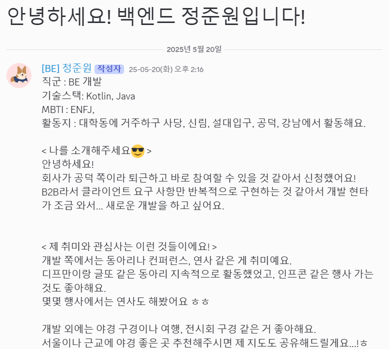
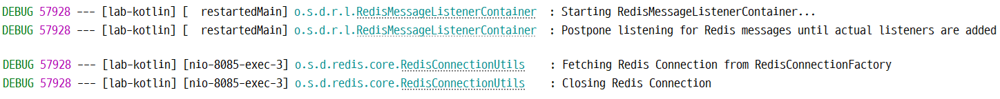
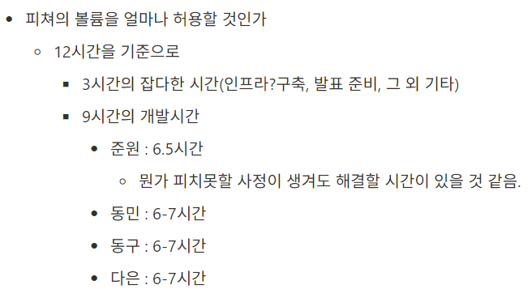

# 배경

최근 팀에서 내부 Gen AI 서버를 구현하면서 리눅스(Ubuntu) GUI를 사용할 일이 생겼다.

로드율 확인과 여러 이유로 인해 GUI가 요구사항이었고, 아무래도 GUI다 보니 ssh만으로는 한계가 있었다.

여러 원격 데스크톱을 사용했지만 무료 원격 툴의 특징이겠지만 어딘가 나사가 하나씩 빠져있거나 가격이 너무 비쌌다.

그리고 해당 서버 관리를 내가 맡게 되면서 아무래도 내가 접속하기 편한 크롬 원격 데스크톱을 사용하고 싶어서 여러 시행착오를 거치며 내용을 정리했다.

주요 문제점은

- 원격 액세스 목록에 안 뜸(g.co/crd/headless 페이지로 이동하여…)
- 원격 접속 시 검은 화면만 뜸
- 직접 서버 컴퓨터 로그인 시 ‘이미 동작 중인 세션’이라고 뜨면서 로그인 안됨

# 트러블 슈팅

## 원격 액세스 목록에 안 뜸(g.co/crd/headless 페이지로 이동하여…)


빈 목록이 뜨며 위와 같은 안내 문구가 뜸

(서치 잔뜩하며 찾아본 것 상으로는 Linux GUI를 제대로 인식 못해서 화면이 없는 설정 모드로 진입하라고 headless로 하라고 뜬다고 한다)

### 해결 방법(원격 액세스 목록 추가)

해결 방법은 둘 중 하나다.

1. 접속 주체(Host)에서 ‘SSH를 통해 설정’ 코드 생성해서 접속 대상(Linux)의 터미널에서 코드를 입력한다.
2. 접속 대상(Linux)에서 ‘SSH를 통해 설정’ 코드 생성해서 접속 주체(Host)의 터미널에서 코드를 입력한다.

간단하게 한 쪽에서는 코드 생성하고, 생성된 코드를 다른 한 쪽에서 터미널 작업을 하면 된다는 의미다.

상세 작업은 아래를 참고하면 된다.



안내 문구에서 나온 링크에 접속하거나 ‘SSH를 통해 설정’ 란에 들어가면 컴퓨터 설정이 뜬다.

시작 > 다음 > 승인

버튼을 차례대로 누르면 된다.



요런 애가 뜨는 데 코드를 입력할 OS에 따라서 맞는 명령어를 복사해서 입력하면 된다.



코드 맨 뒤에 name 파라미터는 호스트 컴퓨터 이름을 설정하는 부분이라서 원하는 이름으로 설정하면 된다.

코드를 입력하면 6자리 접속 비밀번호를 입력하라고 뜬다.
비번 확인까지 2번 입력하면 된다.

## 원격 접속 시 검은 화면만 뜸

ubuntu 최신 버전의 경우 기본적으로 디스플레이 서버 프로토콜로 wayland를 사용한다.

근데, wayland가 크롬 원격에서 호환성 문제가 있어서 이게 문제인 경우가 종종 있다.

### 디스플레이 서버 프로토콜 확인

- echo $XDG_SESSION_TYPE


아래 내용은 wayland일 경우 시도해볼만한 내용이다.

### 해결

크롬 원격 데스크톱은 오랫동안 디스플레이 서버로 사용됐던 X11 버전에서 호환성이 좋기에 Ubuntu의 디스플레이 서버를 wayland → X11 로 변경하면 해결될 수도 있다.

GDM 파일 수정

- sudo nano /etc/gdm3/custom.conf
- Wayland 비활성화
    - WaylandEnable=false 부분의 주석을 해제해주면 된다.


GDM 재시작 혹은 리부트

- sudo reboot
- sudo systemctl restart gdm3

GDM 파일 수정 후 컴퓨터나 GDM을 재시작해주면 된다.


디스플레이 서버를 다시 출력했을 때 x11 이라고 뜨면 성공한 것이다.

만약 안된다면 바로 아래 케이스에서 FIRST_X_DISPLAY_NUMBER 를 바꾸는 부분을 적용하면 될 수도 있다.

## 직접 서버 컴퓨터 로그인 시 ‘이미 동작 중인 세션’이라고 뜨면서 로그인 안됨


**이미 동작 중인 세션**

로컬 세션이 이미 ubuntu에 대해 동작 중이므로 로그인이 불가능합니다. 로그인하려면 지금 세션에서 로그아웃하거나 세션을 강제로 중지하십시오.

강제로 중지하면 실행 중인 앱과 프로세스가 중지되므로, 데이터를 잃어버릴 수 있습니다.

라는 경고창이 뜬다.

‘강제로 중지’를 선택해도 크롬 원격이 계속 자동으로 재실행돼서 그런지 동작하지 않았다.

저 상태에서는 컴퓨터 로그인 자체가 안돼서 터미널로 접속하는 게 아니면 답이 없다.

참고로 로그인 화면에서 터미널 접속하는 방법은 `Ctrl` + `Alt` + `F3` 를 동시에 누르면 된다.

해당 경고창은 크롬 원격이 해당 유저의 로그인 세션을 점유해서 생기는 문제다.
해결 방법은 해당 로그인 세션과 디스플레이를 공유하면 된다.(하지만 이렇게 해도 동시 접속이 안되고 매번 로그아웃 처리를 해줘야하는 단점이 있긴 했다.)

### 해결

우선 위에서 알려준 방법대로 터미널로 접속한다.

이후 로그인해주고, 해당 display의 번호와 원격 display를 맞춰준다.


- echo $DISPLAY
    - 여기서 나온 display 번호를 잘 기억해주고 아래 원격 display 번호와 맞춰준다.
- sudo nano /opt/google/chrome-remote-desktop/chrome-remote-desktop
    - FIRST_X_DISPLAY_NUMBER 를 위의 번호와 맞춰준다.
        
    - get_unused_display_number
        

        - display번호를 증가시키는 부분을 주석처리한다.
        - 우리는 display 번호를 고정해서 사용할 거라 저 부분이 필요 없다.
    - launch_session(self, server_args, backoff_time)
        

        - 해당 이름의 함수가 여러 개라서 매개 변수를 잘 보고 확인해야한다.
        - 빨간 박스로 된 self._setup_gnubby()부터 self.launch~~ 까지 4줄을 주석처리한다.
        - 그리고 그 아래 파란 박스로 된 저 두 줄을 추가한다.

            ```
            display = self.get_unused_display_number()
            self.child_env["DISPLAY"] = ":%d" % display
            ```

- /opt/google/chrome-remote-desktop/chrome-remote-desktop --start

크롬 원격 앱을 다시 실행해서 접속을 확인한다.
